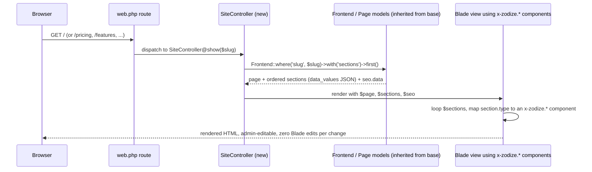

# Frontend–Backend Bridge

> The specific, real gap between the two audited codebases every product is
> built from, and how to close it. Builds on
> [`base-codebase-strategy.md`](./base-codebase-strategy.md).

## The gap, stated plainly

Zodize has two audited codebases, and today they do not talk to each other:

1. **The base back office** (`/home/qfsfountains/public_html`, see
   [`base-codebase-strategy.md`](./base-codebase-strategy.md)) has a real,
   working CMS: `Admin/FrontendController.php` + `Models/Frontend.php` +
   `Page.php` render section-based, admin-editable public pages from the
   `frontends` and `pages` tables, with SEO metadata under `seo.data`. This
   already works for the base engine's own native Blade views.
2. **The Zodize marketing frontend shell** (`/home/zodize/public_html`) has
   the real, implemented design system every product's public pages must
   use — Bootstrap 5 + Zodize-theme tokens matching
   [`../design-system/`](../design-system/), and a library of reusable Blade
   components at `resources/views/components/zodize/`, namespaced
   `x-zodize.*`. **Verified correction**: a direct filesystem audit of this
   directory confirms only **eight** components currently exist —
   `button`, `badge`, `card`, `input`, `textarea`, `container`, `section`,
   and `nav.header` (26KB, substantial). An earlier draft of this document
   additionally listed `nav.footer`, `hero`, `feature-grid`, `testimonial`,
   `pricing-table`, `faq`, `cta-band`, `stat-block`, `logo-cloud`,
   `breadcrumbs`, `empty-state`, and `404` as existing — **none of those
   twelve were found on disk** in this audit pass. Treat them as **not yet
   built** rather than existing-but-unaudited: any product's marketing site
   that needs a hero section, pricing table, testimonial block, FAQ
   accordion, or footer nav will need that component built first, following
   the confirmed eight components' conventions, before it can be used in
   the section-type-to-component mapping below. **This frontend is
   currently 100% static Blade with hardcoded content.** It does not read
   from the base's `frontends`/`pages` tables at all.

The result: today, editing a product's homepage copy or SEO tags requires a
Blade code change, which directly contradicts the "buyer never edits code"
model in [`overview.md`](./overview.md#the-business-model-this-architecture-serves).
Closing this gap — wiring the design-system components to the CMS data — is
real, non-trivial engineering work. It is not already solved, and no
product spec may assume it is done without this bridge being built first.

## Target architecture



## Implementation plan

1. **Introduce a `SiteController`** in the product's own codebase (not a
   modification of the inherited `Admin/FrontendController`, which remains
   the admin-side editor) that mirrors how the base engine's own native
   views already consume `Frontend`/`Page` — read the page record and its
   ordered section data for a given route/slug, and pass it to a Blade view
   instead of returning hardcoded markup.
2. **Define a section-type → component mapping.** Each row in a page's
   section data (as authored via the inherited `FrontendController` admin
   UI) carries a `type` (e.g. `hero`, `feature_grid`, `testimonial`,
   `pricing_table`, `faq`, `cta_band`, `stat_block`, `logo_cloud`) and a
   `data_values` JSON payload matching that component's expected props. The
   rendering Blade view (e.g. `resources/views/site/page.blade.php`) loops
   the page's sections and dispatches each one to the matching
   `x-zodize.<type>` component, passing `data_values` as props:
   ```blade
   @foreach ($sections as $section)
       @switch ($section->type)
           @case ('hero')
               <x-zodize.hero :="$section->data_values" />
               @break
           @case ('feature-grid')
               <x-zodize.feature-grid :="$section->data_values" />
               @break
           {{-- ... one @case per component in the x-zodize.* library --}}
       @endswitch
   @endforeach
   ```
3. **Extend the admin section editor's schema, not its engine.** The
   inherited `FrontendController` admin UI already lets an admin add/reorder
   sections with arbitrary JSON data. The only change required is
   registering the `x-zodize.*` component set (and each component's expected
   prop shape) as the list of section "types" an admin can choose from —
   this is a configuration/documentation task on top of the existing engine,
   not a rebuild of it.
4. **SEO metadata.** `Frontend`'s `seo.data` (title, description, OG image,
   canonical) is read by `SiteController` and passed to a shared
   `<x-zodize.seo-head>`-style partial in the page's `<head>`, replacing any
   hardcoded `<title>`/meta tags in the static shell.
5. **Navigation and footer.** `x-zodize.nav.header` / `x-zodize.nav.footer`
   accept a nav-items prop; source these from a small admin-editable
   `nav_items` setting (reusing the `GeneralSetting`/`Frontend` pattern)
   rather than hardcoding the menu in the Blade layout.
6. **Non-CMS pages stay code-defined.** Application pages that are not
   marketing content (the authenticated dashboard, admin panel itself,
   transactional flows) are NOT run through this bridge — they continue to
   be built as ordinary Blade views per
   [`../standards/`](../standards/) and
   [`../templates/dashboard-template.md`](../templates/dashboard-template.md).
   The bridge applies specifically to the public marketing site scope
   defined in
   [`../templates/marketing-website-template.md`](../templates/marketing-website-template.md).

## What ships per product vs. what is built once

The `SiteController`, the section-type-to-component mapping, and the
section rendering Blade partial are built **once**, against the sanitized
base codebase, as part of the same one-time cleanup pass described in
[`base-codebase-strategy.md`](./base-codebase-strategy.md#one-time-base-cleanup-fix-once-before-first-clone).
Every product then clones a base that already has this bridge working;
a product-specific task is limited to authoring that product's actual page
content and section data through the admin UI (or via the `DemoSeeder` —
see [`../development/migration-seeder-standards.md`](../development/migration-seeder-standards.md#seeders))
— never re-implementing the bridge.

## Acceptance criteria for the bridge

- An admin can add a new section to the homepage, of an already-registered
  type, entirely through the existing `FrontendController` admin UI, and see
  it rendered on the live site using the correct `x-zodize.*` component with
  zero Blade/code changes.
- Every component in the `x-zodize.*` library at
  `resources/views/components/zodize/` has a corresponding registered
  section `type` and documented `data_values` prop schema.
- SEO title/description/OG tags editable via the admin CMS are reflected in
  the rendered page's `<head>` without a code change.
- The static marketing shell's hardcoded demo content is replaced by seeded
  `frontends`/`pages` rows via `DemoSeeder`, so a fresh product install shows
  a fully populated, on-brand marketing site out of the box — matching the
  Demo Standard in [`../../README.md`](../../README.md).

## Related standards

- [`base-codebase-strategy.md`](./base-codebase-strategy.md)
- [`../design-system/components.md`](../design-system/components.md)
- [`../templates/marketing-website-template.md`](../templates/marketing-website-template.md)
- [`../standards/admin-configuration-baseline.md`](../standards/admin-configuration-baseline.md)
