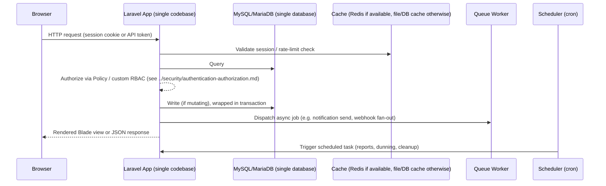

# System Architecture Overview

> How every Zodize product is built and deployed. This is the entry point
> for [`../architecture/`](./); read it before
> [`single-tenant-deployment-model.md`](./single-tenant-deployment-model.md),
> [`base-codebase-strategy.md`](./base-codebase-strategy.md),
> [`frontend-backend-bridge.md`](./frontend-backend-bridge.md),
> [`plugin-architecture.md`](./plugin-architecture.md),
> [`marketplace-architecture.md`](./marketplace-architecture.md), or
> [`caching-queues-events.md`](./caching-queues-events.md).

## The business model this architecture serves

Zodize does not operate any product as a hosted SaaS service. **Every Zodize
product is sold as standalone, self-hosted source code** to a non-technical
business-owner buyer. The buyer:

1. Purchases the product's source code.
2. Provisions their own shared or VPS hosting and domain — Zodize does not
   host it for them.
3. Uploads the codebase and imports one SQL database dump.
4. Sets database credentials in `.env` — the only file-level configuration
   step required.
5. From that point forward, configures **everything else** — branding,
   payment gateways, withdrawal methods, KYC forms, referral commissions,
   languages, pages, SEO, extensions — from the product's own web admin
   panel. No code editing, no CLI, no deploy pipeline the buyer operates.

Every architectural decision in this handbook is downstream of that model.
There is no multi-tenant SaaS control plane, no shared identity provider
across products, and no product that depends on another product or on a
central Zodize-operated service being reachable at runtime. See
[`single-tenant-deployment-model.md`](./single-tenant-deployment-model.md)
for the full implication of this on data modeling, and
[`base-codebase-strategy.md`](./base-codebase-strategy.md) for how a single
audited base codebase makes building 20 independent products tractable
without each one being built from zero.

## Modular monolith, one codebase per product

Every Zodize product is a **single, independent Laravel application**,
organized into clearly bounded modules (e.g. for ZodiBank: `Accounts`,
`Payments`, `Cards`, `Compliance`), deployed by the buyer as one unit onto
their own hosting. There is no shared platform service and no cross-product
network dependency — see
[`single-tenant-deployment-model.md`](./single-tenant-deployment-model.md#no-shared-platform-service).

Zodize deliberately rejects microservices as the default for every product,
which every product spec MUST treat as settled unless an ADR overrides it
for a specific, justified case (see [`../decisions/`](../decisions/)):

- **The buyer runs shared/VPS hosting.** A typical buyer has one hosting
  account and one domain, not a Kubernetes cluster. A microservice
  architecture is undeployable by the actual customer; a single Laravel
  codebase that runs behind Apache/Nginx + PHP-FPM on commodity shared or
  VPS hosting is not just simpler, it is the only thing the buyer can
  operate.
- **Transactional integrity.** Financial-grade products (ZodiBank,
  ZodiTrade, ZodiXchange) need multi-table transactions (e.g., debit one
  ledger row and credit another, atomically) that are trivial within one
  database and one Laravel transaction, and are a distributed-transaction
  problem across services.
- **One database, one backup, one restore.** The buyer's entire operational
  and disaster-recovery story is "back up this one database and this one
  codebase directory." See
  [`../security/backup-disaster-recovery.md`](../security/backup-disaster-recovery.md).

Module boundaries are still enforced at the code level, not just by
convention: each domain module lives under its own namespace, owns its own
Eloquent models, migrations, policies, and routes, and MUST NOT reach into
another module's internals directly — cross-module calls go through the
other module's public service class or fire/listen to a domain event (see
[`caching-queues-events.md`](./caching-queues-events.md#event-driven-architecture)).
This is what "modular" buys inside a single-tenant, single-codebase product:
a maintainable, comprehensible codebase for the small team building it —
not a future microservice extraction, which is explicitly out of scope for
this business model.

## One base codebase, twenty independent products

Zodize does not build each of the twenty products from an empty Laravel
install. Every product starts as a clone of one audited, sanitized base
codebase (internally derived from what shipped at
`/home/qfsfountains/public_html`) that already provides a complete, working
admin back office: general settings/branding, a double-entry wallet ledger,
30+ payment gateway integrations, withdrawal methods, a referral engine, a
plan/subscription pattern, KYC, i18n, cron, an extension toggle system, and
a CMS/page builder. See
[`base-codebase-strategy.md`](./base-codebase-strategy.md) for the full
inventory of what is inherited as-is, what must be stripped, and what tech
debt is fixed once in the base before the first product clones it.

Every product's public-facing marketing site starts as a clone of the
Zodize design-system frontend shell (internally derived from what shipped at
`/home/zodize/public_html`) — a Bootstrap 5 + Blade component library
already matching [`../design-system/`](../design-system/). That frontend is
currently static and disconnected from the base codebase's CMS; wiring it up
is a documented, scoped task, not an assumption — see
[`frontend-backend-bridge.md`](./frontend-backend-bridge.md).

Building a new product is therefore: clone the sanitized base, run the
[genericization checklist](./product-genericization-checklist.md) to strip
banking-specific tables/models that don't apply, wire the frontend bridge,
then build the product's own domain modules per its
[`docs/products/<product>/SPEC.md`](../products/). This is dramatically
cheaper than a from-scratch build per product, and it is why the product
build order in [`../../ROADMAP.md`](../../ROADMAP.md) prioritizes validating
this pipeline once, early, over any notion of inter-product dependency.

## Deployment topology (per product, per buyer)

Each deployed instance of a product runs entirely within one buyer's
hosting account:

- **Web** — PHP-FPM (or the hosting provider's PHP handler) behind
  Apache/Nginx, serving both the Laravel-rendered marketing/admin pages and
  the product's API. No assumption of a load balancer or multiple nodes —
  the reference deployment target is a single shared/VPS host, though a
  buyer running a larger VPS/dedicated server MAY scale to multiple PHP-FPM
  workers behind a local load balancer without any code change.
- **Queue workers** — `php artisan queue:work`, run via the hosting
  provider's process supervisor (cPanel/Plesk "Setup Node.js/PHP App" style
  process manager, or Supervisor/systemd on a VPS the buyer controls). See
  [`caching-queues-events.md`](./caching-queues-events.md#queue-standard).
  A product MUST also support the database queue driver as a fallback for
  buyers on hosting without persistent worker process support, with a
  documented performance caveat.
- **Scheduler** — a single cron entry (`php artisan schedule:run`, once per
  minute) configured by the buyer via their hosting control panel's cron UI,
  driving every scheduled task — see
  [`../development/environment-config-standards.md`](../development/environment-config-standards.md).
- **No required WebSocket/broadcast server.** Because the reference
  deployment target is shared/VPS hosting that may not support persistent
  socket processes, real-time UI features degrade gracefully to polling by
  default; a product MAY document Reverb/Pusher-compatible broadcasting as
  an optional enhancement for buyers on VPS hosting that supports it, never
  as a hard requirement — see
  [`caching-queues-events.md`](./caching-queues-events.md#broadcasting-standard).

There is no CDN, no separately built SPA, and no separate frontend deploy
pipeline assumed by default: the buyer uploads one codebase. A product MAY
use Vite-built assets compiled ahead of time and committed/shipped as part
of the source code archive the buyer receives, so the buyer never needs to
run a Node build step.

## Request lifecycle

Every request that mutates data follows this shape: authenticate, authorize,
mutate inside a transaction, dispatch any side-effects (notifications,
webhooks, cache invalidation) as queued jobs rather than inline synchronous
work where the hosting environment supports a queue worker, with a
synchronous fallback documented for buyers on hosting that does not — see
[`caching-queues-events.md`](./caching-queues-events.md) and
[`../quality/performance-standards.md`](../quality/performance-standards.md).

## Related standards

- [`single-tenant-deployment-model.md`](./single-tenant-deployment-model.md)
- [`base-codebase-strategy.md`](./base-codebase-strategy.md)
- [`frontend-backend-bridge.md`](./frontend-backend-bridge.md)
- [`product-genericization-checklist.md`](./product-genericization-checklist.md)
- [`plugin-architecture.md`](./plugin-architecture.md)
- [`marketplace-architecture.md`](./marketplace-architecture.md)
- [`caching-queues-events.md`](./caching-queues-events.md)
- [`../development/`](../development/)
- [`../quality/ci-cd-standards.md`](../quality/ci-cd-standards.md)
