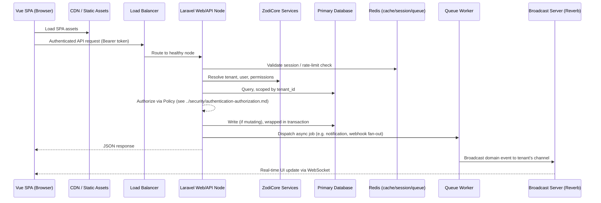

# System Architecture Overview

> How every Zodize product is built, deployed, and how it relates to the
> shared ZodiCore platform. This is the entry point for
> [`../architecture/`](./); read it before `multi-tenancy.md`,
> `plugin-architecture.md`, `marketplace-architecture.md`, or
> `caching-queues-events.md`.

## Modular monolith, not microservices

Every Zodize product is built as a **modular monolith**: a single Laravel
codebase per product, organized into clearly bounded modules (e.g. for
ZodiBank: `Accounts`, `Payments`, `Cards`, `Compliance`), deployed as one
unit but internally structured so a module could be extracted into a
service later without a rewrite.

Zodize deliberately rejects microservices as the default for these reasons,
which every product spec MUST treat as settled unless an ADR overrides it
for a specific, justified case (see `../decisions/`):

- **~20 products, one team-sized org.** Microservices earn their complexity
  cost primarily through independent team scaling and independent deploy
  cadence across many teams. Zodize's engineering org does not have that
  shape; a modular monolith gives most of the maintainability benefit
  (enforced module boundaries) without the operational cost (service mesh,
  distributed tracing as a baseline requirement, N deployment pipelines).
- **Shared platform, not shared services.** Every product depends on
  ZodiCore for identity, billing, tenancy, and notifications (below).
  Consuming ZodiCore as a well-versioned internal package/API is
  architecturally simpler and more reliable than N products each calling M
  microservices over the network for every request.
- **Transactional integrity.** Financial-grade products (ZodiBank,
  ZodiTrade, ZodiXchange) need multi-table transactions (e.g., debit one
  ledger row and credit another, atomically) that are trivial within one
  database and one Laravel transaction, and are a distributed-transaction
  problem across microservices.
- **Operational simplicity.** One deploy pipeline, one set of migrations,
  one log stream, one place to look, per product — critical for a lean
  on-call rotation. See
  [`../quality/monitoring-observability.md`](../quality/monitoring-observability.md).

Module boundaries are enforced at the code level, not just by convention:
each module lives under its own top-level namespace (`app/Modules/<Name>/`),
owns its own Eloquent models, migrations, policies, and routes, and MUST NOT
reach into another module's internals directly — cross-module calls go
through the other module's public service class or fire/listen to a domain
event (see
[`caching-queues-events.md`](./caching-queues-events.md#event-driven-architecture)).
This is what "modular" buys: a future extraction to a separate service is a
matter of moving a folder and swapping direct calls for HTTP/queue calls,
not an untangling project.

## ZodiCore as the shared platform

ZodiCore is not a product a customer buys directly — it is the platform
every other product is a tenant application on top of. Every vertical
product (ZodiBank, ZodiMed, ZodiCommerce, etc.) MUST consume, not
reimplement, the following ZodiCore services:

| ZodiCore service | Provides | Consumed via |
|---|---|---|
| Identity | Authentication, MFA, SSO/SAML, session management | See [`../security/authentication-authorization.md`](../security/authentication-authorization.md) |
| Tenancy | Tenant provisioning, tenant/team scoping, subdomain and custom-domain routing | See [`multi-tenancy.md`](./multi-tenancy.md) |
| Billing | Subscription plans, metered usage, invoicing, payment processing | Shared `Billing` module, exposed as internal service classes and a tenant-facing billing UI mounted into every product |
| Notifications | Email, SMS, in-app, and push notification dispatch with per-tenant templates | Laravel's Notification system, channels registered centrally |
| Plugin runtime | Plugin installation, hook dispatch, sandboxing | See [`plugin-architecture.md`](./plugin-architecture.md) |

Architecturally, ZodiCore ships as a Composer package (`zodize/core`)
installed into every product's Laravel application, providing base migrations,
models (`Tenant`, `User`, `Team`, `Role`, `Permission`, `Plugin`,
`Subscription`), service providers, and Artisan commands. A product's own
codebase adds its domain modules on top and MUST NOT fork or duplicate any
`zodize/core` model — extending via Eloquent model events, policies, and the
plugin hook system instead of copy-modifying core files.

## Deployment topology

Every product deploys the following process types, each independently
scalable:

- **Web** — stateless PHP-FPM (or equivalent) processes behind a load
  balancer, serving the Laravel API and server-rendered auth/marketing
  pages. Horizontally scaled; no local filesystem state (sessions and
  uploads go to Redis/object storage, never local disk).
- **API** — in most products, served by the same web process as the API is
  Laravel's primary interface to the Vue SPA; large products MAY split API
  traffic onto dedicated web nodes behind a separate target group for
  independent scaling, without splitting the codebase.
- **Queue workers** — `php artisan queue:work` processes, scaled per queue
  priority (see
  [`caching-queues-events.md`](./caching-queues-events.md#queue-standard)),
  running supervised (Supervisor/systemd/container orchestrator restart
  policy) so a crashed worker resumes automatically.
- **Scheduler** — a single `php artisan schedule:run` cron entry (once per
  minute) driving all of the product's scheduled tasks; scheduled task
  overlap protection (`->withoutOverlapping()`) is mandatory for any task
  that is not idempotent.
- **WebSocket/broadcast server** — Laravel Reverb (or a Pusher-compatible
  service) for real-time UI updates, see
  [`caching-queues-events.md`](./caching-queues-events.md#broadcasting-standard).

The Vue frontend is a separately built SPA, served as static assets from a
CDN, that talks to the Laravel API exclusively over authenticated HTTP(S)
and the WebSocket server for real-time channels — the frontend build is
never coupled to the backend deploy (see
[`../quality/ci-cd-standards.md`](../quality/ci-cd-standards.md)).

## Request lifecycle

Every request that mutates data follows this shape: authenticate,
tenant-resolve, authorize, mutate inside a transaction, dispatch any
side-effects (notifications, webhooks, cache invalidation, broadcast) as
queued jobs rather than inline synchronous work — see
[`caching-queues-events.md`](./caching-queues-events.md) for the queue and
event standards this depends on, and
[`../quality/performance-standards.md`](../quality/performance-standards.md)
for the latency budget this lifecycle must fit inside.

## Related standards

- [`multi-tenancy.md`](./multi-tenancy.md)
- [`plugin-architecture.md`](./plugin-architecture.md)
- [`marketplace-architecture.md`](./marketplace-architecture.md)
- [`caching-queues-events.md`](./caching-queues-events.md)
- [`../development/`](../development/)
- [`../quality/ci-cd-standards.md`](../quality/ci-cd-standards.md)
