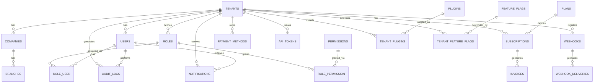

# ZodiCore — Data Model

Companion to [SPEC.md](./SPEC.md). Conforms to
[database-standards.md](../../development/database-standards.md): UUID v7
primary keys, `tenant_id` scoping, `created_at`/`updated_at`/`deleted_at` on
every table (omitted from the column lists below for brevity — assume
present on every table unless noted).

## Entity-relationship diagram

## Core tables

### `tenants`
| Column | Type | Notes |
|---|---|---|
| id | uuid | PK |
| name | varchar | |
| slug | varchar | unique, used for subdomain |
| status | enum | `trial`, `active`, `suspended`, `canceled` |
| plan_id | uuid | FK → plans, current active plan |
| billing_email | varchar | |
| custom_domain | varchar nullable | |
| trial_ends_at | timestamptz nullable | |

### `companies`
| Column | Type | Notes |
|---|---|---|
| id | uuid | PK |
| tenant_id | uuid | FK → tenants |
| name | varchar | |
| legal_name | varchar nullable | |
| tax_id | varchar nullable | |
| default_currency | char(3) | ISO 4217 |

### `branches`
| Column | Type | Notes |
|---|---|---|
| id | uuid | PK |
| company_id | uuid | FK → companies |
| tenant_id | uuid | FK → tenants (denormalized for scope queries) |
| name | varchar | |
| address_json | jsonb | |
| timezone | varchar | IANA tz name |

### `users`
| Column | Type | Notes |
|---|---|---|
| id | uuid | PK |
| tenant_id | uuid | FK → tenants |
| email | varchar | unique per tenant |
| password_hash | varchar nullable | null for SSO-only users |
| mfa_enabled | boolean | |
| status | enum | `invited`, `active`, `suspended` |
| last_login_at | timestamptz nullable | |

### `roles`, `permissions`, `role_permission`, `role_user`
Per [rbac-permissions.md](../../security/rbac-permissions.md). `roles.tenant_id`
nullable for system-default roles shared across tenants;
`permissions.key` is the `resource.action` string (e.g. `invoices.create`).

### `subscriptions`, `plans`, `invoices`, `payment_methods`
| Table | Key columns |
|---|---|
| plans | `id`, `code`, `name`, `price_minor_units`, `currency`, `billing_interval`, `entitlements_json` |
| subscriptions | `id`, `tenant_id`, `plan_id`, `status`, `current_period_start`, `current_period_end`, `cancel_at_period_end` |
| invoices | `id`, `tenant_id`, `subscription_id`, `number`, `status`, `subtotal_minor_units`, `tax_minor_units`, `total_minor_units`, `currency`, `issued_at`, `due_at`, `paid_at` |
| payment_methods | `id`, `tenant_id`, `gateway`, `gateway_reference`, `type`, `is_default` |

### `notifications`, `notification_preferences`
| Table | Key columns |
|---|---|
| notifications | `id`, `tenant_id`, `user_id`, `type`, `channel`, `payload_json`, `read_at`, `sent_at` |
| notification_preferences | `id`, `user_id`, `notification_type`, `channel`, `enabled` |

### `audit_logs`
| Column | Type | Notes |
|---|---|---|
| id | uuid | PK |
| tenant_id | uuid | FK |
| actor_user_id | uuid nullable | null for system-initiated actions |
| acted_as_user_id | uuid nullable | set during impersonation |
| action | varchar | `resource.action` |
| subject_type | varchar | |
| subject_id | uuid | |
| before_json | jsonb nullable | |
| after_json | jsonb nullable | |
| ip_address | inet | |
| user_agent | varchar | |
| occurred_at | timestamptz | append-only, no `updated_at` |

Append-only: no application code path issues an `UPDATE` or `DELETE`
against `audit_logs`; enforced by a database-level trigger denying those
statements for all application roles except a break-glass admin role used
only for legally-mandated redaction with its own audit trail.

### `plugins`, `tenant_plugins`
| Table | Key columns |
|---|---|
| plugins | `id`, `slug`, `name`, `vendor`, `manifest_json`, `status` (marketplace listing status) |
| tenant_plugins | `id`, `tenant_id`, `plugin_id`, `status`, `granted_scopes_json`, `installed_at` |

### `api_tokens`, `webhooks`, `webhook_deliveries`
| Table | Key columns |
|---|---|
| api_tokens | `id`, `tenant_id`, `user_id`, `name`, `token_hash`, `abilities_json`, `last_used_at`, `expires_at` |
| webhooks | `id`, `tenant_id`, `target_url`, `signing_secret_hash`, `event_types_json`, `status` |
| webhook_deliveries | `id`, `webhook_id`, `event_id`, `response_status`, `response_body`, `attempt_count`, `delivered_at` |

### `feature_flags`, `tenant_feature_flags`
| Table | Key columns |
|---|---|
| feature_flags | `id`, `key`, `description`, `default_enabled`, `owner`, `created_at`, `planned_removal_at` |
| tenant_feature_flags | `id`, `tenant_id`, `feature_flag_id`, `enabled`, `reason` |

## Cross-tenant isolation guarantee

Every table above except `plans`, `permissions` (system-defined), and
`feature_flags` (definitions, not values) carries `tenant_id` and is covered
by the mandatory global scope and cross-tenant isolation test suite defined
in [multi-tenancy.md](../../architecture/multi-tenancy.md) and
[testing-standards.md](../../development/testing-standards.md#non-negotiable-test-cases).
