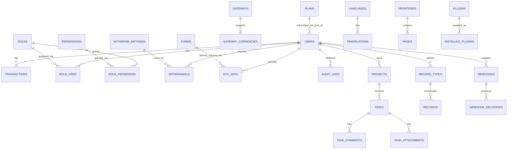

# ZodiCore — Data Model

Companion to [SPEC.md](./SPEC.md). Conforms to
[database-standards.md](../../development/database-standards.md). This is
one buyer's one deployment's schema — there is no `tenant_id` column
anywhere in it, per
[single-tenant-deployment-model.md](../../architecture/single-tenant-deployment-model.md).
`created_at`/`updated_at`/`deleted_at` are present on every table unless
noted, and are omitted from the column lists below for brevity.

## Why there is no `tenants` table

Earlier drafts of this document modeled `tenants`, `subscriptions`,
`invoices`, and `payment_methods` as a SaaS billing schema, because ZodiCore
was wrongly assumed to bill other Zodize products' customer organizations.
Zodize does not operate ZodiCore (or any product) as a hosted service, and
does not bill a buyer on an ongoing subscription basis — a buyer purchases
the source code once and owns the deployment forever, per
[overview.md](../../architecture/overview.md#the-business-model-this-architecture-serves).
There is therefore no `tenants` table, no recurring `subscriptions`/
`invoices` billing-of-the-buyer schema, and no `payment_methods` table for
Zodize to charge the buyer. The `plans`/`gateways`/`transactions` tables
that do exist model the buyer's *own* business selling to *their own* end
customers — an entirely different relationship than Zodize-to-buyer.

## Entity-relationship diagram

## Inherited base engine tables

These tables come from the sanitized base codebase unmodified, per
[base-codebase-strategy.md](../../architecture/base-codebase-strategy.md).
ZodiCore's genericization pass strips the banking-specific tables (`loans`,
`dps`, `fdr`, `branches`/`branch_staff`, `other_banks`, `beneficiaries`,
`airtime_operators`) and keeps everything below.

### `general_settings`
| Column | Type | Notes |
|---|---|---|
| id | bigint | PK, single row |
| site_name | varchar | |
| logo_path | varchar | |
| favicon_path | varchar | |
| cur_text | varchar | base currency code |
| cur_sym | varchar | base currency symbol |
| timezone | varchar | IANA tz name |
| socialite_json | json | social login provider config |

### `users`
| Column | Type | Notes |
|---|---|---|
| id | bigint | PK |
| name | varchar | |
| email | varchar | unique |
| password | varchar | hashed |
| balance | decimal | current wallet balance, minor-units precision |
| ref_by | bigint nullable | FK → users, referral tree parent |
| kyc_data | json nullable | latest submitted KYC payload |
| kyc_status | enum | `unverified`, `pending`, `verified`, `rejected` |
| status | enum | `active`, `suspended` |

No `tenant_id` — every row belongs to this one deployment's one business.

### `transactions`
| Column | Type | Notes |
|---|---|---|
| id | bigint | PK |
| user_id | bigint | FK → users |
| amount | decimal | signed — positive credit, negative debit |
| post_balance | decimal | user's balance immediately after this row |
| trxn_type | varchar | deposit, withdrawal, transfer, referral_commission, admin_adjustment, task/record-triggered types added by ZodiCore's own modules |
| remark | varchar | |
| created_at | timestamptz | append-only, no `updated_at` mutation path |

Append-only per [wallet-system.md](../../standards/wallet-system.md) — a
correction is a new offsetting row, never an edit to a past one.

### `balance_transfers`
| Column | Type | Notes |
|---|---|---|
| id | bigint | PK |
| sender_id | bigint | FK → users |
| receiver_id | bigint | FK → users |
| amount | decimal | |
| sender_transaction_id | bigint | FK → transactions |
| receiver_transaction_id | bigint | FK → transactions |

### `roles`, `permissions`, `role_permission`, `role_user`
Per [rbac-permissions.md](../../security/rbac-permissions.md). Custom
first-party RBAC (not Spatie), inherited from the base engine's `Role`/
`Permission` models. `permissions.key` is the `resource.action` string
(e.g. `withdrawals.approve`).

### `gateways`, `gateway_currencies`
| Table | Key columns |
|---|---|
| gateways | `id`, `name`, `is_active`, `credentials_json` |
| gateway_currencies | `id`, `gateway_id`, `currency_code`, `conversion_rate` |

See [payment-gateways.md](../../standards/payment-gateways.md).

### `withdraw_methods`, `withdrawals`
| Table | Key columns |
|---|---|
| withdraw_methods | `id`, `name`, `input_form_schema_json`, `min_amount`, `max_amount`, `fee` |
| withdrawals | `id`, `user_id`, `withdraw_method_id`, `amount`, `status`, `submitted_data_json`, `approved_by`, `approved_at`, `transaction_id` |

### `plans`
| Column | Type | Notes |
|---|---|---|
| id | bigint | PK |
| name | varchar | |
| description | text | |
| price_or_rate | decimal | |
| term | varchar nullable | |
| limits_json | json | |
| features_json | json | |
| is_active | boolean | |

The genericized `Plan` pattern per
[base-codebase-strategy.md](../../architecture/base-codebase-strategy.md#genericizing-the-plan-pattern) —
a buyer-configured offering their own end users purchase, not a
Zodize-to-buyer billing plan.

### `forms`, `kyc_data`
| Table | Key columns |
|---|---|
| forms | `id`, `name`, `fields_schema_json` |
| (on `users`) | `kyc_data` (submitted values), `kyc_status` |

### `languages`
| Column | Type | Notes |
|---|---|---|
| id | bigint | PK |
| code | varchar | e.g. `en`, `ar`, `fr` |
| name | varchar | |
| is_default | boolean | |
| is_active | boolean | |

Translation strings live in `core/lang/{code}.json`, not a database table —
see [localization-i18n.md](../../standards/localization-i18n.md).

### `frontends`, `pages`
| Table | Key columns |
|---|---|
| frontends | `id`, `slug`, `sections_json`, `seo_json` |
| pages | `id`, `frontend_id`, `title`, `content`, `is_published` |

See [frontend-backend-bridge.md](../../architecture/frontend-backend-bridge.md).

### `audit_logs`
| Column | Type | Notes |
|---|---|---|
| id | bigint | PK |
| actor_user_id | bigint nullable | null for system-initiated actions |
| action | varchar | `resource.action` |
| subject_type | varchar | |
| subject_id | bigint | |
| before_json | json nullable | |
| after_json | json nullable | |
| ip_address | varchar | |
| user_agent | varchar | |
| occurred_at | timestamptz | append-only, no `updated_at` |

Append-only per [audit-logging.md](../../security/audit-logging.md).

## ZodiCore's own domain tables

### `projects`, `tasks`, `task_comments`, `task_attachments`
| Table | Key columns |
|---|---|
| projects | `id`, `name`, `owner_id`, `status` |
| tasks | `id`, `project_id`, `title`, `assignee_id`, `due_date`, `priority`, `status` |
| task_comments | `id`, `task_id`, `user_id`, `body` |
| task_attachments | `id`, `task_id`, `file_path`, `uploaded_by` |

### `record_types`, `records`
| Table | Key columns |
|---|---|
| record_types | `id`, `name`, `fields_schema_json` (same dynamic-schema pattern as `forms`) |
| records | `id`, `record_type_id`, `data_json`, `created_by` |

## Optional plugin/marketplace tables

Present only in a ZodiCore deployment whose buyer has the plugin system
enabled, per
[plugin-architecture.md](../../architecture/plugin-architecture.md) and
[marketplace-architecture.md](../../architecture/marketplace-architecture.md).

### `plugins`, `installed_plugins`
| Table | Key columns |
|---|---|
| plugins | `id`, `slug`, `name`, `vendor`, `manifest_json` — the marketplace listing catalog this deployment's admin panel fetched |
| installed_plugins | `id`, `plugin_id`, `status`, `granted_scopes_json`, `installed_at` — installs into *this deployment only* |

### `webhooks`, `webhook_deliveries`

Buyer-configured endpoints for the buyer's own integrations (not a
Zodize-to-Zodize or cross-deployment webhook system):

| Table | Key columns |
|---|---|
| webhooks | `id`, `target_url`, `signing_secret_hash`, `event_types_json`, `status` |
| webhook_deliveries | `id`, `webhook_id`, `event_id`, `response_status`, `response_body`, `attempt_count`, `delivered_at` |

## Data scoping

Every table above belongs to this one deployment. A buyer running multiple
companies/branches under one deployment scopes the relevant tables via
`company_id`/`branch_id`, per
[localization-i18n.md](../../standards/localization-i18n.md#multi-company--multi-branch-data-scoping) —
ZodiCore does not ship this scoping layer enabled by default, since a plain
back-office deployment has no built-in multi-branch concept, but the
`companies`/`branches` pattern is available to any product (including a
buyer's own extension of ZodiCore) that needs it. There is no cross-tenant
isolation test category for this data model, per
[single-tenant-deployment-model.md](../../architecture/single-tenant-deployment-model.md#what-single-tenant-changes-in-the-data-model).
